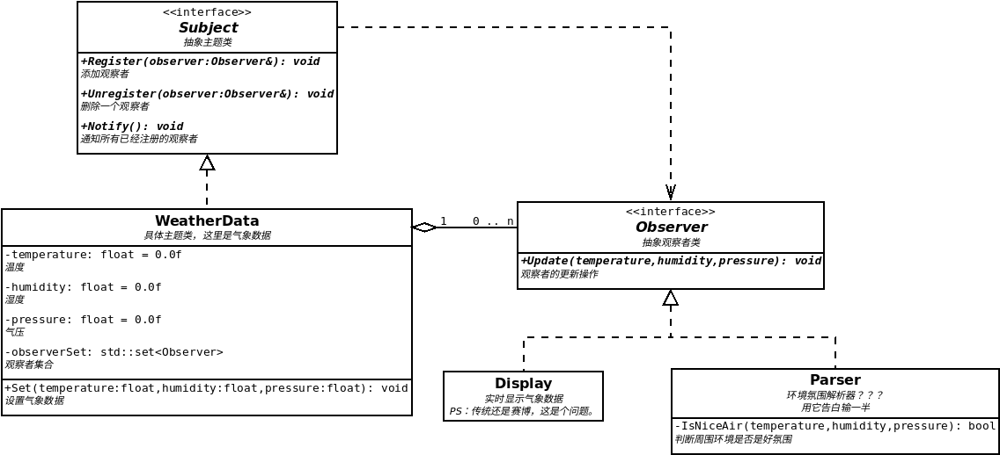

# 设计模式

## 1. 简介
设计模式的英文名称为 design pattern，是一种通用的、可重用的、面向对象的软件设计解决方案。
设计模式是软件开发人员在软件开发过程中面临的一般的软件设计的解决方案。
设计模式有三大类，分别是创建型、结构型和行为型。

## 2. 创建型

## 3. 结构型

## 4. 行为型
### 4.1 观察者模式
观察者模式适用于对象之间一对多的依赖关系，当一个对象的状态发生改变时，所有依赖它的对象都会收到通知并**自动**更新。  
主要有以下角色：
1. 抽象主题：提供增加/删除观察者的接口和通知观察者的接口
2. 抽象观察者：提供更新观察者的接口
3. 具体主题：抽象主题的具体实现
4. 具体观察者：抽象观察者的具体实现

示例：
以气象数据为例，当气象数据（具体主题）发生变化时，所有显示屏（具体观察者）都要刷新显示数据（观察者的更新操作）。  
类图如下：  
   
示例：[观察者模式的简单示例](behavioral-pattern/observer/1/test.cpp)  
示例：[使用泛型适应不同的主题](behavioral-pattern/observer/2/test.cpp)  
示例: [对泛型的优化，使观察者的编码变得更灵活](behavioral-pattern/observer/3/test.cpp)  
